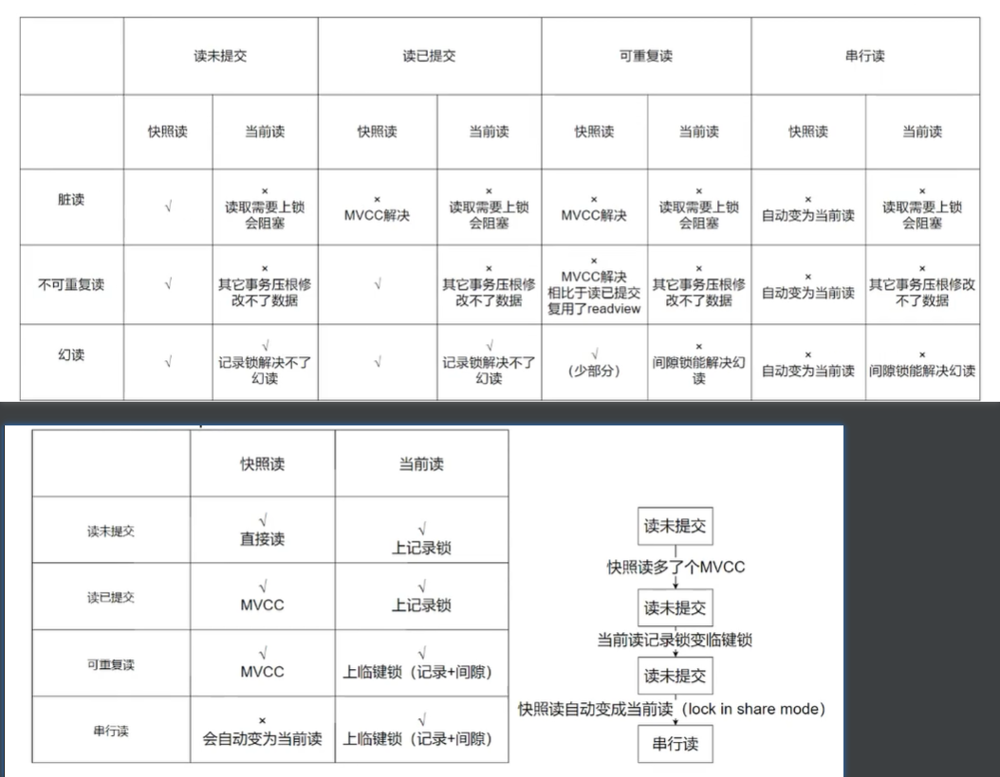
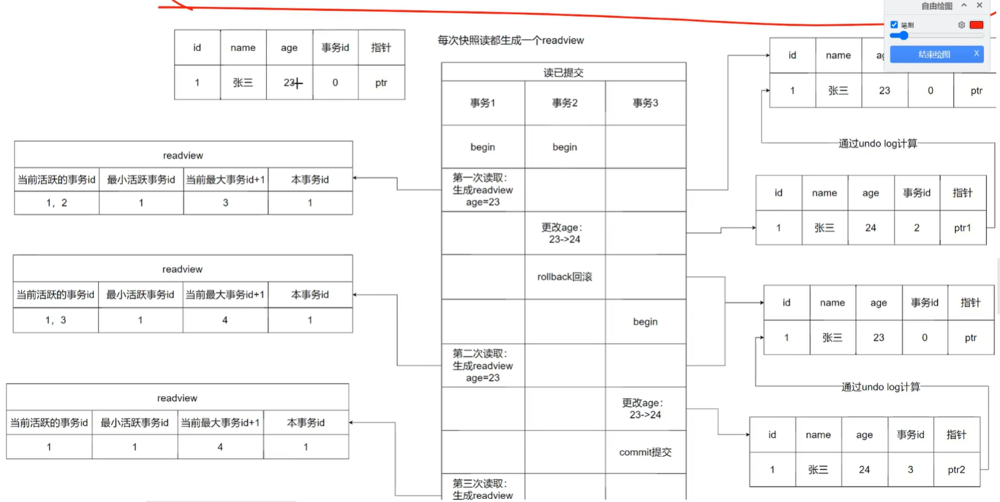
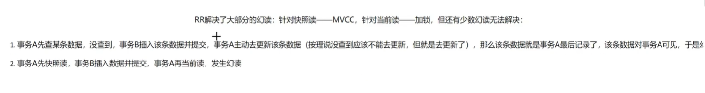
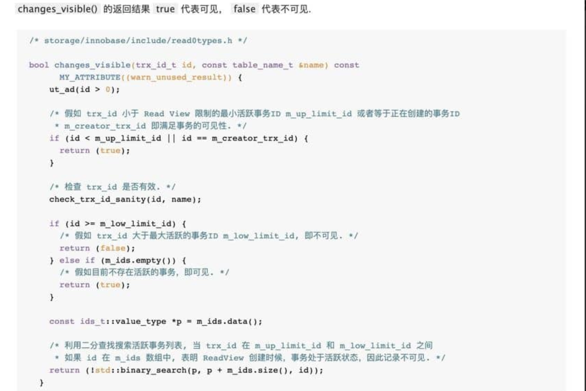

### 不同隔离级别解决的问题及解决方式

### read view的一个例子：

### 可重复读隔离级别下的两种没有解决的幻读

mvcc（只在读已提交和可重复读隔离级别下生效）：
在读已提交隔离级别下的流程：
如果行记录的事物id是本事物id，则本记录可读
如果不是， 再看行记录的事物id是否在“最小活跃事物id”和“最大事物id” 之间
且不在当前活跃的事物id集合中，说明事物已经提交了，可读
如果以上都不满足，则找到第一个小于最小活跃事物id的事物id记录，既最新的已提交的版本

在可重复读隔离级别下的区别就是会复用本事物的第一个readview

readview在第一个查询语句时生成，而不是事物开启时生成

不同读取方式下的不同隔离级别的读取行为：
快照读：读未提交：直接读  读已提交和可重复读：MVCC 串行化：自动变为当前读，既临键锁
当前读：读未提交和读已提交隔离级别下是上记录锁，可重复读和串行化隔离级别下是上临键锁（记录锁+间隙锁）

### 代码流程：
trx_id_t 是当前判断的记录的最后修改/插入的事务的id
