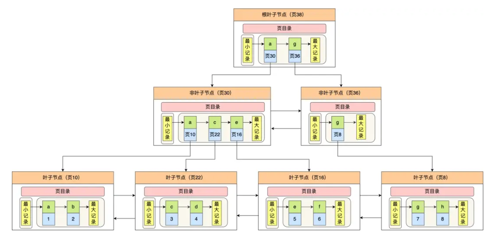

# 1. 索引结构

   通过上图，我们看出 B+ 树的特点
   ·只有叶子节点(最底层的节点)才存放了数据，非叶子节点(其他上层节)仅用来存放目录项作为索
   引。
   非叶子节点分为不同层次，通过分层来降低每一层的搜索量;
   ·所有节点按照索引键大小排序，构成一个双向链表，便于范围查询，
   我们再看看 B+树如何实现快速査找主键为6的记录，以上图为例子:
   ·从根节点开始，通过二分法快速定位到符合页内范围包含查询值的页，因为查询的主键值为 6，在[1,7)
   范围之间，所以到页 30 中查找更详细的目录项;
   在非叶子节点(页30)中，继续通过二分法快速定位到符合页内范围包含查询值的页，主键值大于5
   所以就到叶子节点(页16)查找记录;
   接着，在叶子节点(页16)中，通过槽查找记录时，使用二分法快速定位要查询的记录在哪个槽(哪
   个记录分组)，定位到槽后，再遍历槽内的所有记录，找到主键为6的记录。
   可以看到，在定位记录所在哪一个页时，也是通过二分法快速定位到包含该记录的页。定位到该页后，又
   会在该页内进行二分法快速定位记录所在的分组(槽号)，最后在分组内进行遍历查找。
# 为什么使用b+树
二分查找树虽然是一个天然的二分结构，能很好的利用二分查找快速定位数据，但是它存在一种极端的情
况，每当插入的元素都是树内最大的元素，就会导致二分查找树退化成一个链表，此时查询复杂度就会从
O(logn)降低为 O(n)。

为了解决二分查找树退化成链表的问题，就出现了自平衡二叉树，保证了查询操作的时间复杂度就会一直
维持在 0(logn)。但是它本质上还是一个二叉树，每个节点只能有2个子节点，随着元素的增多，树的高
度会越来越高。
而树的高度决定于磁盘 I/0 操作的次数，因为树是存储在磁盘中的，访问每个节点，都对应一次磁盘 I/0
操作，也就是说树的高度就等于每次査询数据时磁盘 10 操作的次数，所以树的高度越高，就会影响查询
性能。

B 树和 B+ 都是通过多又树的方式，会将树的高度变矮，所以这两个数据结构非常适合检索存于磁盘中的
数据。但是 MySQL 默认的存储引擎 InnoDB 采用的是 B+ 作为索引的数据结构，原因有:
1. B+ 树的非叶子节点不存放实际的记录数据，仅存放索引，因此数据量相同的情况下，相比存储即存索
引又存记录的 B树，B+树的非叶子节点可以存放更多的索引，因此 B+ 树可以比B树更「矮胖」，查
询底层节点的磁盘 /O次数会更少。
2. B+ 树有大量的冗余节点(所有非叶子节点都是冗余索引)，这些冗余索引让 B+ 树在插入、删除的效
率都更高，比如删除根节点的时候，不会像 B树那样会发生复杂的树的变化;
3. B+ 树叶子节点之间用链表连接了起来，有利于范围查询，而 8树要实现范围查询，因此只能通过树的
遍历来完成范围查询，这会涉及多个节点的磁盘 0 操作，范围查询效率不如 B+树。
# 数据量
- 非叶子节点内指向其他页的数量为 x
- 叶子节点内能容纳的数据行数为 y
- B+ 数的层数为 z
- Total =x^(z-1) *y 也就是说总数会等于 x 的 z-1 次方 与 Y 的乘积
-  x=15*1024/12≈1280 行（假设有15k用来存数据，主键我们假设是 Bigint (8 byte), 而页号也是固定的（4Byte）, 那么索引页中的一条数据也就是 12byte。）
- Y = 15*1024/1000 ≈15 （假设有15k用来存数据，一条数据1k）
假设 B+ 树是三层，那就是 z = 3， Total = （1280 ^2） *15 = 24576000 （约 2.45kw）
但如果每一行数据量达到了5k，Total = （1280 ^2） *3 = 4915200 （近 500w）