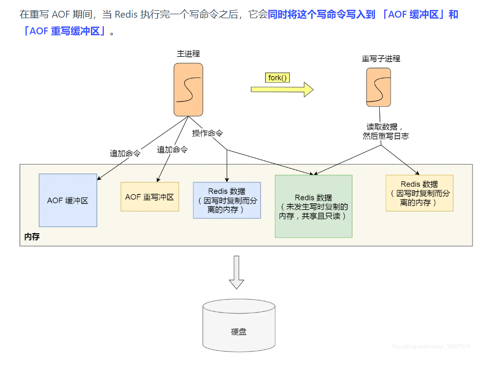
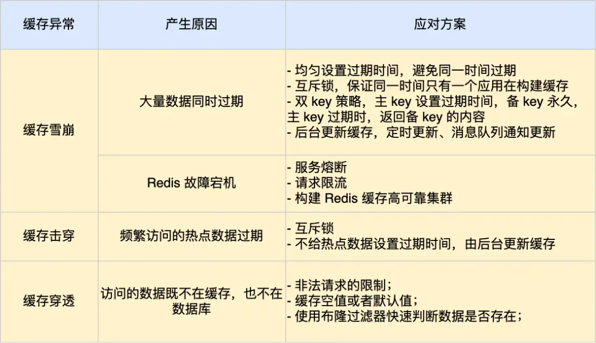
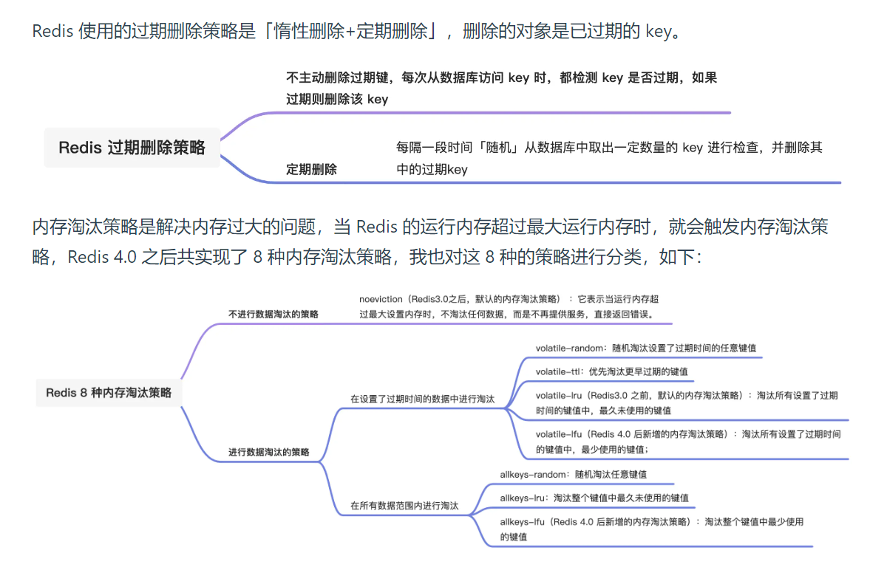

1. hash用于购物车的实现（变化的部分只有数量）

2. redis数据结构

   可以看到，Redis数据类型的底层数据结构随着版本的更新也有所不同，
   比如: 在 Redis 3.0 版本中 List 对象的底层数据结构由「双向链表」或「压缩表列表」实现，但是在 3.2 版本
   之后，List 数据类型底层数据结构是由 quicklist 实现的;
   在最新的 Redis 代码中，压缩列表数据结构已经废弃了，交由 listpack 数据结构来实现了
   1. Redis 五种数据类型的应用场景:
      - String 类型的应用场景:缓存对象、常规计数、分布式锁、共享session信息等。
      - List 类型的应用场景:消息队列(有两个问题:1.生产者需要自行实现全局唯一 ID;2.不能以消费组形
      式消费数据)等。
      - Hash 类型:缓存对象、购物车等。
      - Set 类型:聚合计算(并集、交集、差集)场景，比如点赞、共同关注、抽奖活动等
      - Zset 类型:排序场景，比如排行榜、电话和姓名排序等。
      - BitMap(2.2 版新增):二值状态统计的场景，比如签到、判断用户登陆状态、连续签到用户总数等
      - HyperLogLog(2.8 版新增):海量数据基数统计的场景，比如百万级网页 UV 计数等:
      - GEO(3.2 版新增):存储地理位置信息的场景，比如滴滴叫车;
      - Stream(5.0 版新增):消息队列，相比于基于 List 类型实现的消息队列，有这两个特有的特性:自动
      生成全局唯一消息ID，支持以消费组形式消费数据。
   2. 针对 Redis 是否适合做消息队列，关键看你的业务场景
      - 如果你的业务场景足够简单，对于数据丢失不敏感，而且消息积压概率比较小的情况下，把 Redis 当作
      队列是完全可以的。
      - 如果你的业务有海量消息，消息积压的概率比较大，并且不能接受数据丢失，那么还是用专业的消息队
      列中间件吧。
   3. 在 Redis 3.2 版本之后，List 数据类型底层数据结构就只由 quicklist 实现了
   4. 在 Redis 7.0 中，压缩列表数据结构已经废弃了，交由 listpack 数据结构来实现了。（Zset和Hash类型之前有使用压缩列表）
3. AOF

总结：
   1. AOF 方法，这个方法是每执行一条写操作命令，就将该命 令以追加的方式写入到 AOF 文件，然后在恢复时，
   以逐一执行命令的方式来进行数据恢复。
   2. Redis 提供了三种将 AOF 日志写回硬盘的策略，分别是 Always、Everysec和 No，这三种策略在可靠性上 
   是从高到低，而在性能上则是从低到高。这三种策略只是在控制 fsync() 函数的调用时机
   3. 随着执行的命令越多，AOF 文件的体积自然也会越来越大，为了避免日志文件过大， Redis 提供了 AOF
   重写机制，它会直接扫描数据中所有的键值对数据，然后为每一个键值对生成一条写操作命令，接着将该
   命令写入到新的 AOF 文件，重写完成后，就替换掉现有的 AOF 日志。重写的过程是由后台子进程完成
   的，这样可以使得主进程可以继续正常处理命令。
   4. 用 AOF 日志的方式来恢复数据其实是很慢的，因为 Redis 执行命令由单线程负责的，而 AOF 日志恢复数
   据的方式是顺序执行日志里的每一条命令，如果 AOF 日志很大，这个「重放」的过程就会很慢了。
4. 缓存雪崩，击穿，穿透

   缓存异常会面临的三个问题:缓存雪崩、击穿和穿透，

   其中，缓存雪崩和缓存击穿主要原因是数据不在缓存中，而导致大量请求访问了数据库，数据库压力骤
   增，容易引发一系列连锁反应，导致系统奔溃。不过，一旦数据被重新加载回缓存，应用又可以从缓存快
   速读取数据，不再继续访问数据库，数据库的压力也会瞬间降下来。因此，缓存雪崩和缓存击穿应对的方
   案比较类似。

   而缓存穿透主要原因是数据既不在缓存也不在数据库中。因此，缓存穿透与缓存雪崩、击穿应对的方案不
   太一样。

5. 缓存过期策略和淘汰策略
