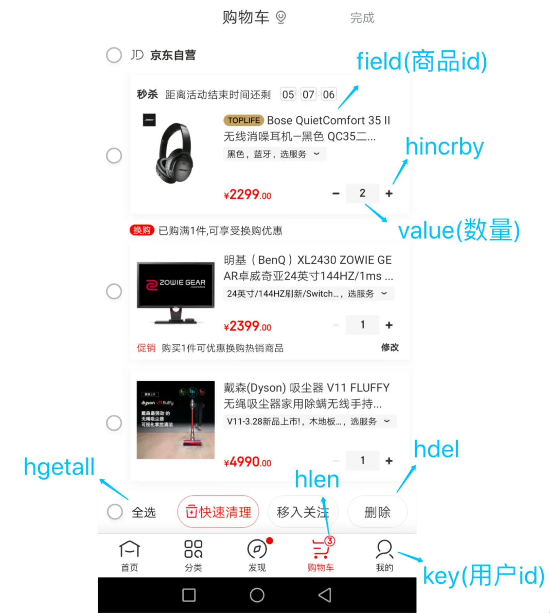
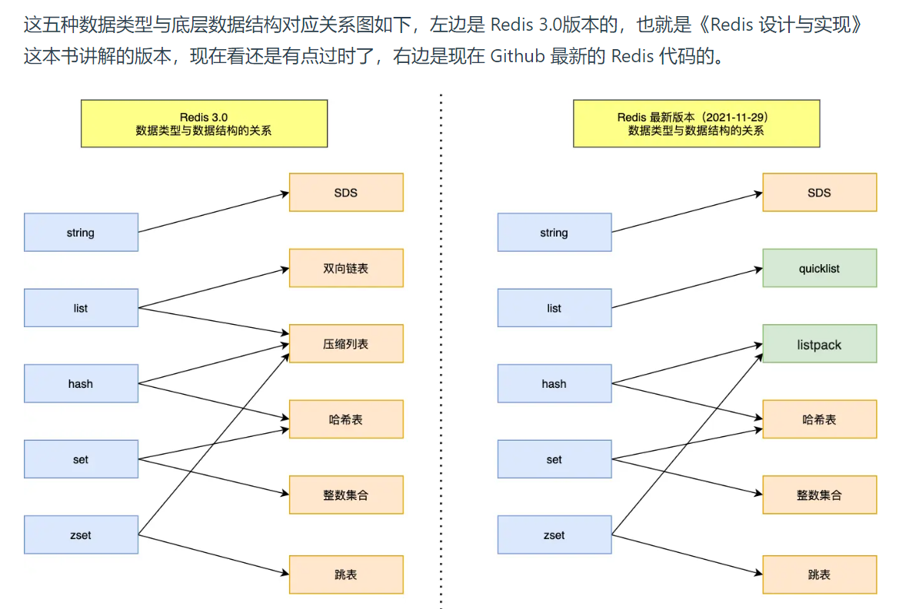

1. hash用于购物车的实现（变化的部分只有数量）

2. redis数据结构

   可以看到，Redis数据类型的底层数据结构随着版本的更新也有所不同，
   比如: 在 Redis 3.0 版本中 List 对象的底层数据结构由「双向链表」或「压缩表列表」实现，但是在 3.2 版本
   之后，List 数据类型底层数据结构是由 quicklist 实现的;
   在最新的 Redis 代码中，压缩列表数据结构已经废弃了，交由 listpack 数据结构来实现了
   1. Redis 五种数据类型的应用场景:
      - String 类型的应用场景:缓存对象、常规计数、分布式锁、共享session信息等。
      - List 类型的应用场景:消息队列(有两个问题:1.生产者需要自行实现全局唯一 ID;2.不能以消费组形
      式消费数据)等。
      - Hash 类型:缓存对象、购物车等。
      - Set 类型:聚合计算(并集、交集、差集)场景，比如点赞、共同关注、抽奖活动等
      - Zset 类型:排序场景，比如排行榜、电话和姓名排序等。
      - BitMap(2.2 版新增):二值状态统计的场景，比如签到、判断用户登陆状态、连续签到用户总数等
      - HyperLogLog(2.8 版新增):海量数据基数统计的场景，比如百万级网页 UV 计数等:
      - GEO(3.2 版新增):存储地理位置信息的场景，比如滴滴叫车;
      - Stream(5.0 版新增):消息队列，相比于基于 List 类型实现的消息队列，有这两个特有的特性:自动
      生成全局唯一消息ID，支持以消费组形式消费数据。
   2. 针对 Redis 是否适合做消息队列，关键看你的业务场景
      - 如果你的业务场景足够简单，对于数据丢失不敏感，而且消息积压概率比较小的情况下，把 Redis 当作
      队列是完全可以的。
      - 如果你的业务有海量消息，消息积压的概率比较大，并且不能接受数据丢失，那么还是用专业的消息队
      列中间件吧。